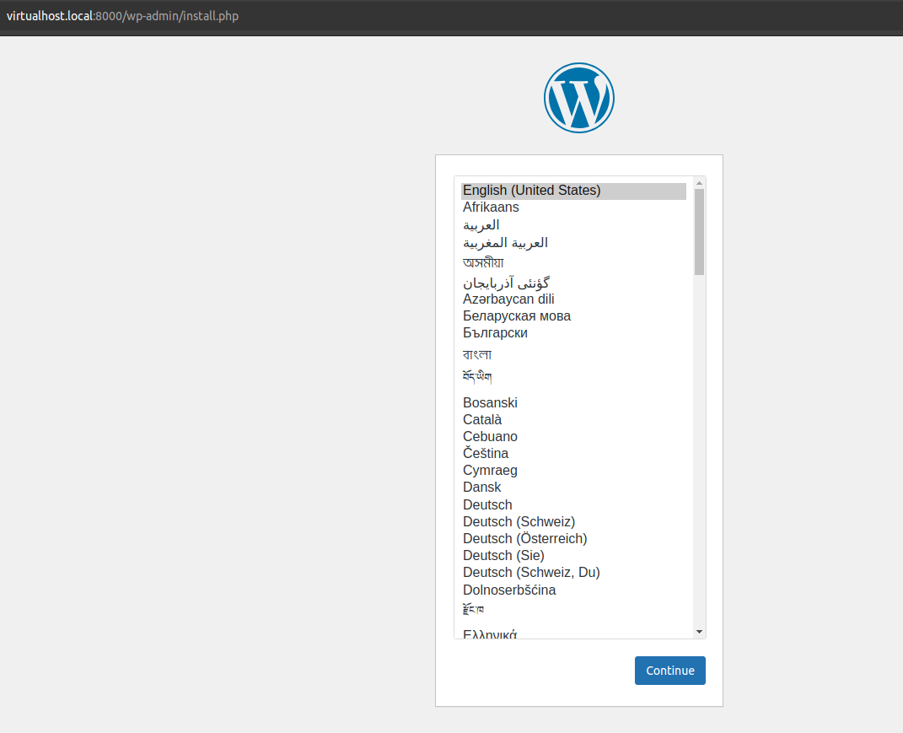
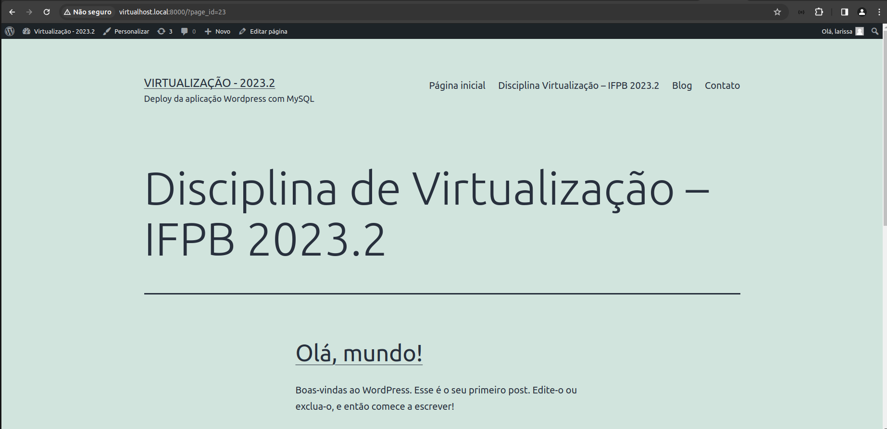

<h1 align="center">Helm: Wordpress + MySQL</h1>

<p align="justify"> 
Objetivo: Instalar usando charts Helm, duas aplicações: wordpress e mysql, no namespace virtualizacao. Faça a configuração necessária para estabelecer a conexão entre as duas aplicações e rodar a interface de gerenciamento do Wordpress. 

Chart do MySQL:<br> https://github.com/bitnami/charts/tree/main/bitnami/mysql

Chart do Wordpress:<br> https://github.com/bitnami/charts/tree/main/bitnami/wordpress
</p>

## Resoluções

<p align="justify">Para este exercício foram criadas duas formas de resolução, a primeira com o uso de dependência na instalação do MySQL para o Wordpress, e a segunda forma com as images do MySQL e Wordpress diretamente no values.yaml. Ambas as formas foram testadas e estão cumprindo o objetivo do exercício.</p>  

<p align="justify">Pré-requisitos:</p>

- Adicione no arquivo /etc/hosts: 127.0.0.1       virtualhost.local
- Se precisar adicione o repositório do bitnami: helm repo add bitnami https://charts.bitnami.com/bitnami

<p>Após instalar o minikube, execute os comandos:</p>

- minikube config set driver docker (certifique-se que o usuário atual pertence ao grupo docker)
- minikube start
- minikube addons enable ingress

<p align="justify">Forma 1: Aplicação com dependência do MySQL (wp-mysql-form1) </p>

```bash
$ kubectl create ns virtualizacao
$ git clone https://github.com/larissalg9/Chart-com-Wordpress-e-MySQL.git
$ cd Chart-com-Wordpress-e-MySQL
$ cd wp-mysql-form1
$ helm dependency update
$ cd ..
$ helm upgrade atv-rep ./wp-mysql-form1 --install --namespace=virtualizacao
$ kubectl port-forward svc/wordpress-service -n virtualizacao 8000:80

Aguarde todos os pods estarem com o status "READY 1/1", em seguida acesse: http://virtualhost.local:8000/
```
<hr>

<p align="justify">Forma 2: Aplicação com as images MySQL e Wordpress no values.yaml (wp-mysql-form2) </p>

```bash
$ kubectl create ns virtualizacao
$ git clone https://github.com/larissalg9/Chart-com-Wordpress-e-MySQL.git
$ cd Chart-com-Wordpress-e-MySQL
$ helm upgrade wordpress-dev ./wp-mysql-form2 --install --namespace=virtualizacao
$ kubectl port-forward svc/wordpress-service -n virtualizacao 8000:80

Aguarde todos os pods estarem com o status "READY 1/1", em seguida acesse: http://virtualhost.local:8000/
```

<br><br>

<p align="center">
    
    <br><br>
    
    <br><br>
</p>
